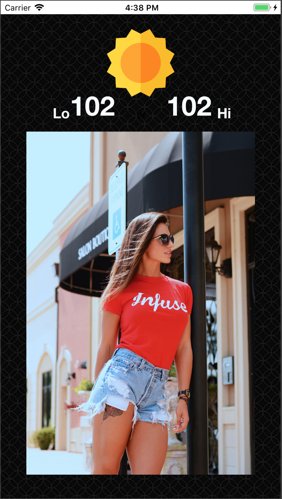

## BiPolar — A weather app that helps you dress


<br/>

BiPolar is a weather app that helps you dress in the morning by checking the weather for you and suggesting outfits based on the weather conditions for the day.

If you live in New England, like I do, you know that the weather can be quite unpredictable. You can wake up to a cold morning and end up feeling hot by the afternoon. This app aims to solve that problem by helping you not only dress for the weather but also gives you style inspiration.

<br/>

## User Interface
So far I've designed a UI that dynamically scales to all screen sizes and resolutions in portrait mode. Further work has to be done to display the information in landscape mode.

<br/>


<br/>

## Weather Underground API
The top portion of the app displays an image of the skies and gives you the High and low temperatures of the day just like any other weather app or service. This information is retrieved by accessing the weather underground API (http://api.wunderground.com/api/).

```swift
private let openWeatherMapBaseURL = "http://api.wunderground.com/api/"
private let openWeatherMapAPIKey = "7bc46d9a64fab8c0"
.
.
.
let weatherRequestURL = URL(string: "\(openWeatherMapBaseURL)\(openWeatherMapAPIKey)/conditions/q/CA/\(city).json")!
```

Further work needs to be done in terms of parsing the JSON data and linking it with the images and data in the view.
